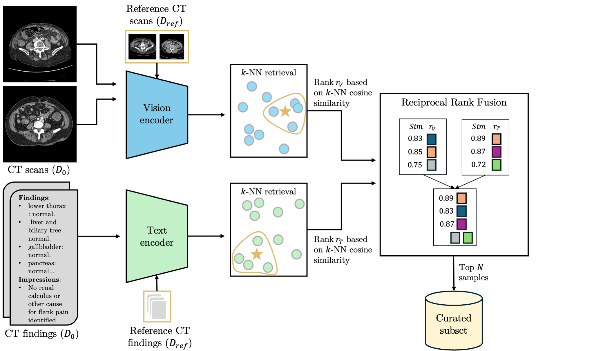

# Reference-Guided Data Curation for 3D Medical Vision-Language Pretraining

<p align="center">
  
</p>

This repository contains the data curation pipeline described in the paper "Reference-Guided Data Curation for 3D Medical Vision-Language Pretraining".

The pipeline filters a large, uncurated pool of medical scan–report pairs
(D₀) by aligning them to a small, high-quality reference set
(D_ref), producing a curated subset D_C ⊆ D₀ that maximises downstream
vision-language model performance.

---

## Table of Contents

- [Overview](#overview)
- [Installation](#installation)
- [Data Format](#data-format)
- [Pipeline](#pipeline)
  - [Step 1 — Embedding Generation](#step-1--embedding-generation)
  - [Step 2 — CLIP Score Filtering (baseline)](#step-2--clip-score-filtering-baseline)
  - [Step 3 — Alignment-Based Filtering](#step-3--alignment-based-filtering)
  - [Step 4 — Reciprocal Rank Fusion](#step-4--reciprocal-rank-fusion)
  - [Step 5 — Select Top-N Samples](#step-5--select-top-n-samples)
- [Repository Structure](#repository-structure)
- [Citation](#citation)

---

## Overview

The curation strategy uses the reference set as an anchor for two independent
quality signals:

| Signal | Embedding model | Similarity measure |
|--------|----------------|--------------------|
| **Vision** | DreamSim (ensemble) | Slice-aligned cosine similarity |
| **Text** | Clinical Longformer | Cosine similarity |

The two signals are combined with **Reciprocal Rank Fusion (RRF)**:

$$\text{Score}_\text{RRF}(x) = \frac{w_1}{\eta + r_V(x)} + \frac{w_2}{\eta + r_T(x)}$$

where $r_V$, $r_T$ are the vision / text ranks, $\eta = 60$, and
$w_1 = w_2 = 1.0$ by default.

Four filtering methods are available:

| Method | Embeddings used |
|--------|----------------|
| `vision_only` | DreamSim |
| `text_only` | Clinical Longformer |
| `early_fusion` | DreamSim + Longformer (concatenated) |
| `rrf` | vision_only + text_only → RRF |

As a baseline, **CLIP-score filtering** selects samples by the cosine
similarity between the CLIP vision and text embeddings of the *same*
scan–report pair (no reference set required).

---

## Installation

```bash
git clone https://github.com/faidrapts/rg-curation-medical-vlm.git
cd rg-curation-medical-vlm
pip install -r requirements.txt
```

---

## Data Format

Both the pool and reference CSVs must contain at minimum:

| Column | Description |
|--------|-------------|
| `sample_id` | Unique identifier for the scan–report pair |
| `image_file` | Image filename (basename relative to `--image-dir`) |
| `findings` | Radiology report findings section |

The column names are fully configurable via `--id-column`,
`--image-column`, and `--text-column`.

**CT volumes** should be stored as `.nii.gz` files.  
**CXR images** should be stored as `.png` or `.jpg` files.

---

## Pipeline

### Step 1 — Embedding Generation

Generate DreamSim (vision) and Clinical Longformer (text) embeddings for
both the pool and the reference set.

**DreamSim embeddings (CT)**

```bash
python scripts/generate_dreamsim_embeddings.py \
    --metadata    /data/pool.csv \
    --image-dir   /data/ct_scans/ \
    --output-dir  /data/embeddings/dreamsim/ \
    --modality    ct
```

CT volumes are preprocessed with the fixed `transforms_image` pipeline defined in
`rg_curation/utils/monai_transforms.py` (RAS orientation, 1.5 × 1.5 × 3 mm spacing,
HU clipped to [−1000, 1000] → [0, 1], padded/cropped to 224 × 224 × 160).

**DreamSim embeddings (CXR)**

```bash
python scripts/generate_dreamsim_embeddings.py \
    --metadata    /data/pool.csv \
    --image-dir   /data/cxr_images/ \
    --output-dir  /data/embeddings/dreamsim/ \
    --modality    cxr
```

**Longformer text embeddings**

```bash
python scripts/generate_longformer_embeddings.py \
    --metadata    /data/pool.csv \
    --output-dir  /data/embeddings/longformer/
```

> Run the same commands for the reference set, saving to the same embedding
> directories (sample IDs are used as filenames, so pool and reference
> embeddings coexist without conflict).

---

### Step 2 — CLIP Score Filtering (baseline)

Compute a per-sample CLIP alignment score without using a reference set.

```bash
python scripts/compute_clip_scores.py \
    --metadata  /data/pool.csv \
    --image-dir /data/ct_scans/ \
    --output    /data/clip_scores.csv \
    --modality  ct
```

Then select the top-N samples (see [Step 5](#step-5--select-top-n-samples)).

---

### Step 3 — Alignment-Based Filtering

Run kNN alignment between the reference set and the pool.

**Vision-only**

```bash
python scripts/run_alignment.py \
    --pool-metadata  /data/pool.csv \
    --ref-metadata   /data/reference.csv \
    --method         vision_only \
    --vision-embeddings-dir /data/embeddings/dreamsim/ \
    --k   5 \
    --output /data/aligned_vision_k5.csv
```

**Text-only**

```bash
python scripts/run_alignment.py \
    --pool-metadata  /data/pool.csv \
    --ref-metadata   /data/reference.csv \
    --method         text_only \
    --text-embeddings-dir /data/embeddings/longformer/ \
    --k   5 \
    --output /data/aligned_text_k5.csv
```

**Early fusion (DreamSim + Longformer)**

```bash
python scripts/run_alignment.py \
    --pool-metadata  /data/pool.csv \
    --ref-metadata   /data/reference.csv \
    --method         early_fusion \
    --vision-embeddings-dir /data/embeddings/dreamsim/ \
    --text-embeddings-dir   /data/embeddings/longformer/ \
    --k   5 \
    --output /data/aligned_early_fusion_k5.csv
```

> The `--top-n` flag can be added to any `run_alignment.py` call to
> combine Steps 3 and 5 in one command.

---

### Step 4 — Reciprocal Rank Fusion

Combine vision and text alignment scores with RRF.

```bash
python scripts/run_rrf.py \
    --vision-scores /data/aligned_vision_k5.csv \
    --text-scores   /data/aligned_text_k5.csv \
    --output        /data/rrf_k5.csv \
    --eta   60 \
    --w-vision 1.0 \
    --w-text   1.0
```

---

### Step 5 — Select Top-N Samples

Filter any scored CSV to the top-N samples:

```bash
# From RRF output
python scripts/select_top_n.py \
    --input        /data/rrf_k5.csv \
    --output       /data/curated_10k.csv \
    --n            10000 \
    --score-column rrf_score

# From alignment output
python scripts/select_top_n.py \
    --input        /data/aligned_vision_k5.csv \
    --output       /data/curated_10k.csv \
    --n            10000 \
    --score-column similarity_score

# From CLIP scores
python scripts/select_top_n.py \
    --input        /data/clip_scores.csv \
    --output       /data/curated_clip_10k.csv \
    --n            10000 \
    --score-column similarity_score
```

---

## Repository Structure

```
rg-curation-medical-vlm/
│
├── rg_curation/                  # Core library
│   ├── embeddings/
│   │   ├── dreamsim.py           # DreamSim embedding generation (CT & CXR)
│   │   ├── longformer.py         # Clinical Longformer text embeddings
│   │   └── clip_score.py         # CLIP vision–text alignment scores
│   ├── filtering/
│   │   ├── alignment.py          # kNN alignment (vision, text, early fusion)
│   │   └── rrf.py                # Reciprocal Rank Fusion
│   └── utils/
│       ├── ct_preprocessing.py   # CT slice extraction & center-mass crop
│       ├── monai_transforms.py   # MONAI transform pipeline for CT loading
│       ├── clip_utils.py         # Legacy CLIP text/image utilities
│       └── text_utils.py         # Text truncation & memory utilities
│
├── scripts/                      # End-to-end pipeline scripts
│   ├── generate_dreamsim_embeddings.py
│   ├── generate_longformer_embeddings.py
│   ├── compute_clip_scores.py
│   ├── run_alignment.py
│   ├── run_rrf.py
│   └── select_top_n.py
│
├── examples/
│   ├── ct/                       # Example CT volumes (.nii.gz)
│   └── cxr/                      # Example CXR images (.png)
│
├── requirements.txt
└── README.md
```

---

## Citation

If you use this code in your research, please cite:

```bibtex
@inproceedings{patsatzi2026rgcurationvlm,
  title     = {Reference-Guided Data Curation for 3D Medical Vision-Language Pretraining},
  url       = {https://github.com/faidrapts/rg-curation-medical-vlm},
  year      = {2026},
}
```
